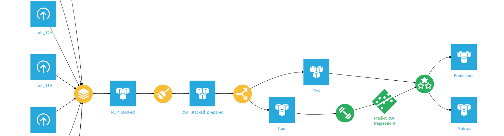
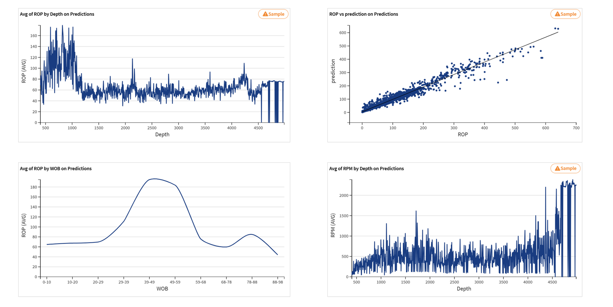

# Industrial ROP Prediction: End-to-End Pipeline (SLB Internship)

> **Predicting Rate of Penetration (ROP) for drilling optimization using an integrated Dataiku DSS pipeline, developed during a Data Science internship at SLB.**

---

## Project Context
In the oil and gas industry, optimizing the **Rate of Penetration (ROP)** is critical for reducing drilling costs and ensuring operational safety. This project focuses on building a robust predictive model that estimates ROP based on real-time drilling parameters, allowing for data-driven decision-making.

### Business Value
* **Operational Efficiency:** Identifying optimal drilling parameters to maximize ROP.
* **Cost Reduction:** Minimizing "Non-Productive Time" (NPT) through better predictive maintenance and performance tracking.
* **Safety:** Providing insights into drilling dynamics to prevent equipment failure.

---

## The Dataiku Flow
This project utilizes the full **Dataiku DSS** suite to manage the data lifecycle. 
**
* **Data Integration:** Cleaning and joining diverse drilling datasets.
* **Feature Engineering:** Creating rolling averages and lagged features to capture the temporal nature of drilling.
* **Automated ML (AutoML):** Benchmarking multiple algorithms (Random Forest, XGBoost) to find the most accurate predictor.

---

## Analytics & Dashboards
The final output of this project was an interactive dashboard designed for drilling engineers to monitor predicted vs. actual performance.
 **
* **Key Metrics:** R2 Score, RMSE, and Feature Importance (Explainable AI).
* **Real-time Monitoring:** Visualization of parameter sensitivities to identify which factors (Weight on Bit, RPM, etc.) most influence ROP.

---

## Technical Stack
* **Platform:** Dataiku Data Science Studio (DSS)
* **Dataset:** Loris Drilling
* **Tools:** Python (Scikit-Learn, Pandas), SQL, Dataiku Visual Recipes
